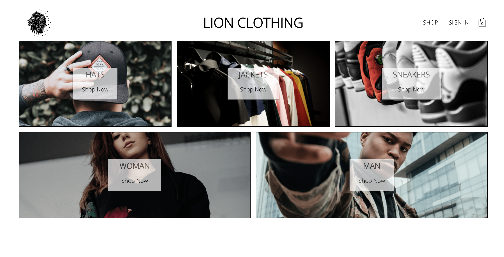
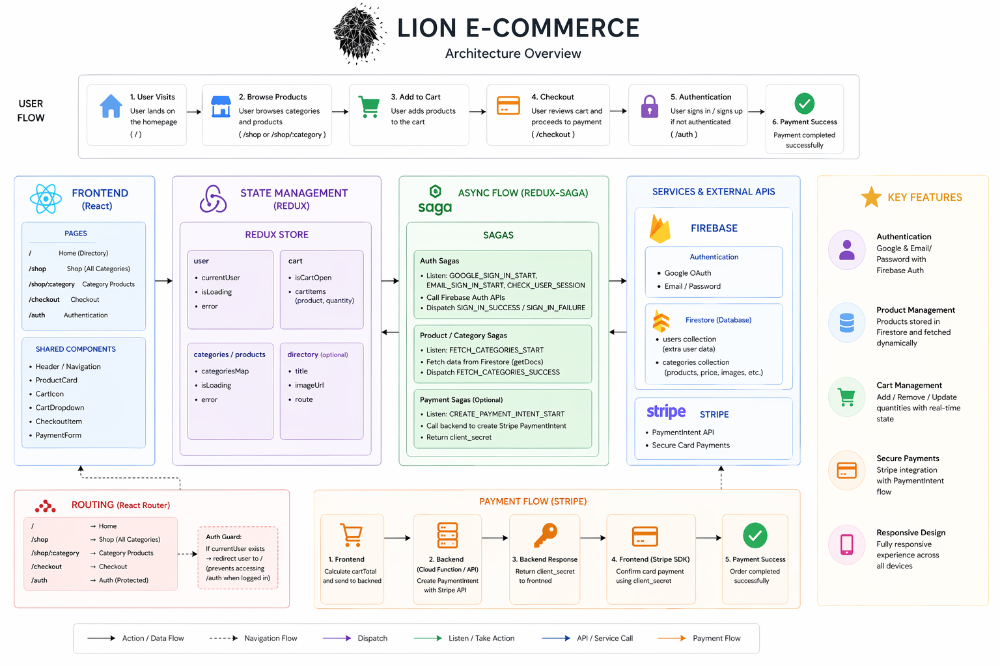
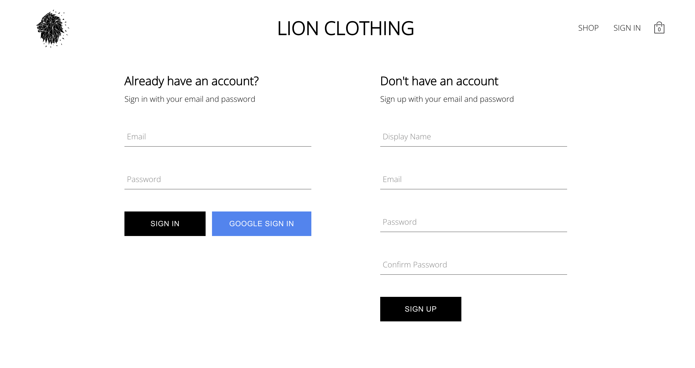
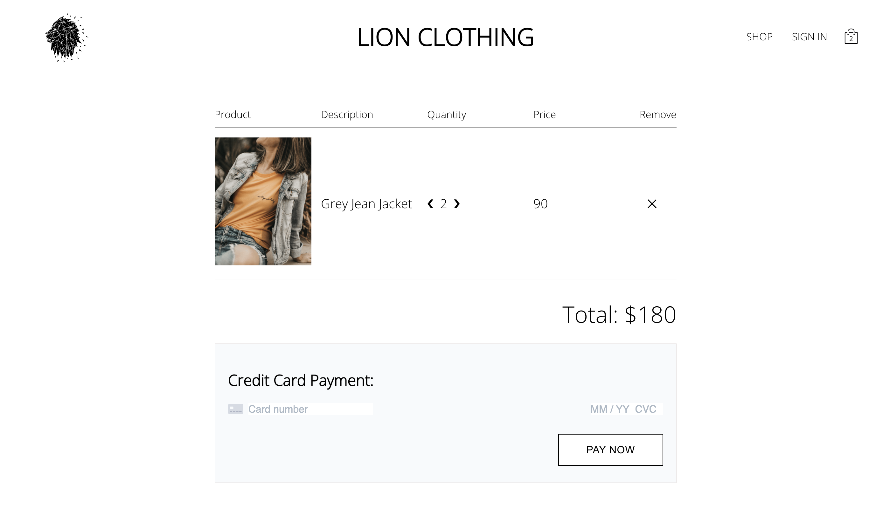

# 🦁 Lion E-Commerce Platform (React)



### 🚀 Production-grade React e-commerce application demonstrating modern frontend architecture, scalable state management, authentication, and payment integration.

### 🚀 Live Demo

[](https://lion-e-commerce.vercel.app/)

---

## 🛠️ Key Technologies


---

## 🧠 About The Project

Lion E-Commerce is a feature-rich clothing store application built to demonstrate real-world frontend engineering practices with the React ecosystem.

The project focuses on:

- Scalable frontend architecture
- Advanced Redux-based state management
- Saga-driven asynchronous flows
- Firebase authentication and Firestore data management
- Stripe payment integration
- Reusable component design
- Testable application structure

This is not only a UI demo. It represents a production-oriented frontend architecture with clear separation between UI, state, side effects, routing, and external services.

---

## 🚨 What Makes This Project Different?

- Uses Redux-Saga instead of basic async patterns
- Designed with scalable architecture in mind
- Clean separation between UI, state, and side effects
- Production-like payment flow (Stripe + backend pattern)

---

## 🏗️ Architecture Diagram



---

## 🏗️ Architecture Overview

The Lion E-Commerce platform is built with a modern, layered frontend architecture using React, Redux, Redux-Saga, Firebase, and Stripe.

It follows a separation of concerns approach to keep the application scalable, maintainable, and easier to reason about as the project grows.

---

## 🔄 State Management (Redux Store)

The global application state is managed with Redux using a modular structure.

### User State

- `currentUser`: Stores the authenticated user object (`uid`, `email`, `displayName`)
- `isLoading`: Controls loading states during authentication flows
- `error`: Handles authentication-related errors

### Cart State

- `isCartOpen`: Controls the cart dropdown visibility
- `cartItems`: Stores selected products and manages product quantities

### Products / Categories State

- `categoriesMap`: Stores products grouped by category such as hats, sneakers, jackets, womens, and mens
- `isLoading`: Tracks product/category fetching status
- `error`: Handles data fetching errors

### Directory State

- Stores homepage category navigation data such as title, image URL, and route path

---

## ⚡ Asynchronous Flow (Redux-Saga)

Redux-Saga is used to manage side effects and asynchronous operations outside of UI components.

### Authentication Flow

- Listens to actions such as `GOOGLE_SIGN_IN_START` and `EMAIL_SIGN_IN_START`
- Calls Firebase Auth methods
- Dispatches `SIGN_IN_SUCCESS` when authentication succeeds
- Handles failed authentication with error actions
- Checks user session persistence with `checkUserSession`

### Product Fetching Flow

- Triggered by `FETCH_CATEGORIES_START`
- Fetches product/category data from Firestore
- Stores the normalized category data in Redux with `FETCH_CATEGORIES_SUCCESS`
- Handles loading and error states during the request lifecycle

### Payment Flow

- Sends the cart total to a backend/serverless endpoint
- Backend creates a Stripe `PaymentIntent`
- Frontend receives the `client_secret`
- Stripe SDK completes the secure card payment flow

---

## 🔌 API & Services

### Firebase

Firebase is used for authentication and data storage.

- **Authentication**
  - Google OAuth
  - Email/password authentication

- **Firestore**
  - `users`: Stores additional user metadata such as `createdAt` and `displayName`
  - `categories`: Stores product information such as name, price, image URL, and category

### Stripe

Stripe is used for payment processing.

Secure payment flow:

1. Frontend sends `cartTotal` to the backend/serverless API
2. Backend creates a Stripe `PaymentIntent`
3. Backend returns the `client_secret`
4. Frontend confirms the payment using Stripe SDK

---

## 🧩 Component Architecture

The application is structured around pages and reusable shared components.

### Pages

- `/` → Home / Directory page
- `/shop` → Shop overview with category previews
- `/shop/:category` → Dynamic category product page
- `/checkout` → Cart review and payment page
- `/auth` → Sign in and sign up page

### Shared Components

- `Header` → Main navigation, logo, auth link, and cart access
- `ProductCard` → Reusable product display card
- `CartIcon` → Cart icon with item count badge
- `CartDropdown` → Mini cart preview dropdown
- `CheckoutItem` → Checkout product row
- `PaymentForm` → Stripe payment form
- `Button` → Reusable button component
- `FormInput` → Reusable form input component

---

## 🧭 Routing Strategy

Routing is handled with React Router.

- `/` → Home
- `/shop` → Shop overview
- `/shop/:category` → Dynamic category page
- `/checkout` → Checkout
- `/auth` → Authentication

### Auth Guard

If `currentUser` exists, the user is redirected away from the auth page to prevent already authenticated users from accessing sign in / sign up screens again.

---

## ⚙️ Tech Stack

### Core

- React
- TypeScript
- React Router DOM

### State Management

- Redux Toolkit
- Redux Saga
- Redux Thunk
- Reselect
- Redux Persist

### Styling

- Styled Components
- Sass

### Integrations

- Firebase Authentication
- Firestore
- Stripe Payments

### Testing

- Jest
- React Testing Library
- Redux Saga Test Plan

---

## 🧩 Key Features

- 🛒 Full e-commerce flow: products, cart, checkout
- 🔐 Firebase authentication with Google and email/password
- 💳 Stripe payment integration
- ⚡ Redux-based global state management
- 🧵 Redux-Saga for async side effects
- ♻️ Persisted state with Redux Persist
- 🎯 Selector-based optimization with Reselect
- 🎨 Modular styling with Styled Components and Sass
- 🧪 Testable structure with Jest and React Testing Library
- 📱 Responsive layout for multiple screen sizes

---

## 🖼️ Screenshots

### Home


### Authentication



### Checkout



---

## 📱 Responsive Design

- Responsive layout across desktop, tablet, and mobile devices
- Reusable UI components designed for flexible screen sizes
- Clean and minimal shopping experience

---

## 🧪 Testing Strategy

The project includes a test-oriented structure for validating UI behavior, state logic, and asynchronous flows.

- Component testing with React Testing Library
- DOM interaction testing with Testing Library utilities
- Redux-related logic testing
- Saga flow testing with Redux Saga Test Plan

---

## 🚀 Run Locally

Clone the project

```bash
git clone https://github.com/bilalhalici/lion-e-commerce.git
```

Go to the project directory

```bash
cd lion-e-commerce
```

Install dependencies

```bash
yarn install
```

Start the development server

```bash
yarn start
```

---

## 🎯 Why This Project?

This project was built to showcase frontend engineering skills beyond basic UI implementation.

It demonstrates:

- Real-world React application structure
- Advanced state management decisions
- Side-effect handling with Redux-Saga
- Authentication and database integration with Firebase
- Payment processing with Stripe
- Clean component composition
- Portfolio-ready project documentation

---

## 👨‍💻 Author

**Bilal Halıcı**

Frontend-led Fullstack Engineer focused on React, Next.js, TypeScript, and scalable web application development.